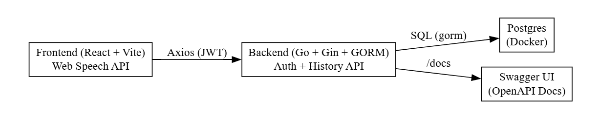

# 🎙️ Text-To-Speech Converter

A full-stack web application that converts text input into speech.  

---

## ✨ Features

### Frontend (Vite + React + Web Speech API)
- **Authentication**: Login with email + password
- **Text Input**: Enter text to be spoken
- **Voice Selection**: Choose available browser voices (language/accent)
- **Audio Controls**: Play, Pause, Resume, Stop
- **Voice Customization**: Adjust rate, pitch, and volume
- **Save Conversion**: Persist conversion history
- **History**: Display previous conversions with replay functionality
- **Replay**: Re-synthesize text using saved settings

### Backend (Go + Gin + GORM + PostgreSQL)
- **Authentication**: Register, Login with JWT
- **History API**: Store, retrieve, and delete conversions
- **Swagger UI**: Interactive API documentation at `/docs`
- **CORS**: Configurable via environment variables

---

## 🏗️ Architecture




**Flow**:
- The **Frontend** uses the Web Speech API for in-browser TTS and communicates with the backend via Axios (Bearer JWT).
- The **Backend** (Go + Gin + GORM) handles authentication and history storage.
- Conversion metadata is stored in **Postgres**.
- API documentation is served via **Swagger UI**.

---

## 🚀 Getting Started

### Prerequisites
- Docker & Docker Compose
- Node.js 18+ (for frontend development)

### Setup
```bash
git clone https://github.com/michaelmichio/tts-app.git
cd tts-app
```

### Run backend + database
```bash
docker compose up -d
```
- API: [http://localhost:8080](http://localhost:8080)  
- Swagger UI: [http://localhost:8080/docs](http://localhost:8080/docs)

### Run frontend
```bash
cd frontend
npm install
npm run dev
```
- Frontend: [http://localhost:5173](http://localhost:5173)

---

## ⚙️ Environment Variables

### Backend (`docker-compose.yml`)
```yaml
APP_ENV=development
PORT=8080
DB_DSN=postgres://postgres:postgres@db:5432/app?sslmode=disable
JWT_SECRET=please_change_me
MEDIA_DIR=/data/media
CORS_ORIGINS=http://localhost:5173,http://localhost:3000
```

### Frontend (`frontend/.env`)
```env
VITE_API_URL=http://localhost:8080
```

---

## 🔑 Main API Endpoints

- **Auth**
  - `POST /api/auth/register`
  - `POST /api/auth/login`
- **Conversions**
  - `POST /api/conversions`
  - `GET /api/conversions`
  - `DELETE /api/conversions/{id}`

👉 Full documentation available at [http://localhost:8080/docs](http://localhost:8080/docs)

---

## 💡 Design Decisions & Trade-offs

- **Web Speech API in Frontend**  
  Chosen to meet assessment requirements. It provides quick implementation without additional costs.  
  *Trade-off*: Voice quality varies across browsers/devices.

- **Swagger UI in Backend**  
  Served at the same port (`:8080/docs`) to avoid CORS issues and simplify demos.

- **Dockerized Setup**  
  All services (backend, DB, pgAdmin) run with Docker Compose for quick, reproducible environments.

---

## 🧪 Testing Flow

1. **Register** via Swagger (`/api/auth/register`)
2. **Login** via frontend (`/login`) → JWT stored
3. **Enter text**, choose voice, adjust settings
4. **Play / Pause / Resume / Stop** speech
5. **Save** conversion → persists in DB
6. **History** appears → replay with Web Speech

---

## 📌 Notes

- In production, a public TTS API (e.g., Google Cloud, AWS Polly) can be proxied through the backend for consistent cross-browser voices.
- Passwords are stored with bcrypt hashing.
- `.editorconfig` and npm scripts at root ensure consistent development experience.

---

## 📜 License
MIT – feel free to use and adapt.
